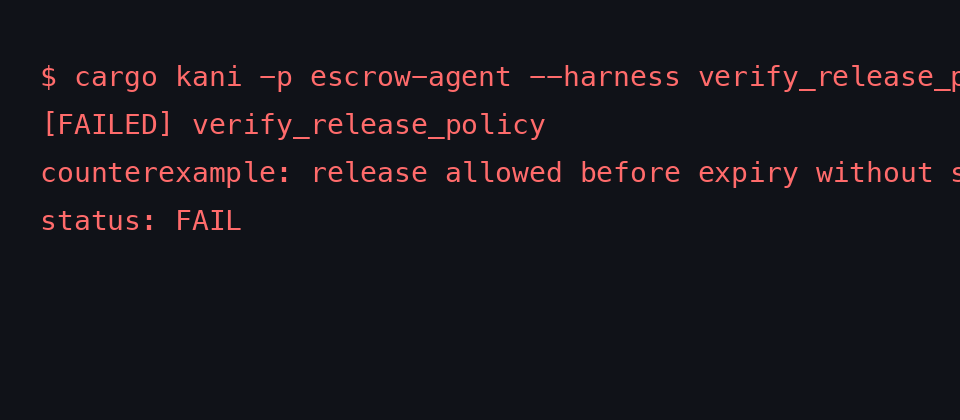
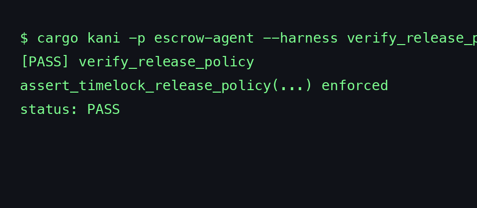
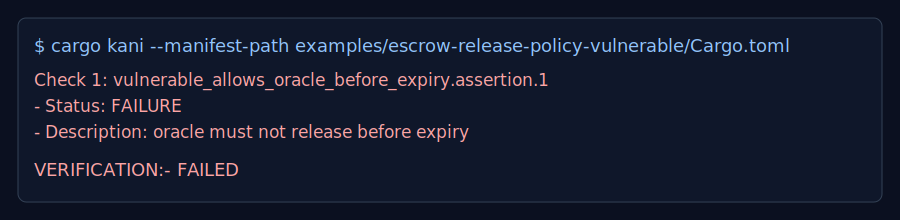
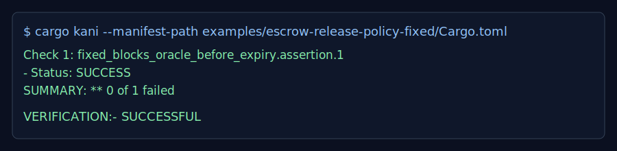

# KAMIYO Kani

[](https://github.com/kamiyo-ai/kamiyo-kani/actions/workflows/ci.yml)
[](https://github.com/kamiyo-ai/kamiyo-kani/actions/workflows/kani.yml)
[](https://github.com/kamiyo-ai/kamiyo-kani/actions/workflows/docs.yml)
[](https://github.com/kamiyo-ai/kamiyo-kani/actions/workflows/benchmark.yml)
[](https://codecov.io/gh/kamiyo-ai/kamiyo-kani)
[](https://crates.io/crates/kamiyo-kani)
[](https://crates.io/crates/kamiyo-kani)
[](LICENSE)


Reusable Kani verification primitives and harnesses for Solana programs.

## Why kamiyo-kani?

Most Solana teams do not need a full formal methods stack. They need a fast path to prove high-value invariants in CI:

- value conservation (lamports and split math)
- bounds and monotonicity in risk math
- PDA seed and bump constraints
- replay and state-transition safety
- `AccountInfo` mutation invariants

This project follows a simple principle: collaboration lifts the ecosystem. Share proof primitives, reduce duplicate mistakes, and make verification normal in shipping workflows.

Project posture:
- contribute generic verification gaps upstream to Kani
- keep Solana-focused agentic verification layers here
- ship runnable fail->fix examples so teams can adopt without a formal methods team

## Install

```toml
[dev-dependencies]
kamiyo-kani = "0.1.1"
```

## Quick start

```rust
#![cfg(kani)]

use kamiyo_kani::risk::{effective_pnl, haircut_ratio};

#[kani::proof]
fn payout_is_bounded_by_profit() {
    let vault: u128 = kani::any();
    let principal_total: u128 = kani::any();
    let insurance: u128 = kani::any();
    let pnl_pos_total: u128 = kani::any();
    let my_pnl: i128 = kani::any();

    let (h_num, h_den) = haircut_ratio(vault, principal_total, insurance, pnl_pos_total);
    let payout = effective_pnl(my_pnl, h_num, h_den);

    kani::assert(payout <= my_pnl.max(0) as u128);
}
```

Run:

```bash
cargo install --locked kani-verifier
cargo kani setup
cargo kani -p kamiyo-kani
```

## Real-world use cases

### Escrow release policy (before/after)

Before (failing release policy):

```rust
let release_allowed = oracle_signed && now >= expires_at;
```

After (correct policy):

```rust
let release_allowed = agent_signed || (oracle_signed && now >= expires_at);
assert_timelock_release_policy(now, expires_at, agent_signed, oracle_signed, release_allowed);
```

Failure run example:



Passing run example:



Cargo Kani output snapshots:




Runnable fail->fix crates:

- `examples/escrow-release-policy-vulnerable`
- `examples/escrow-release-policy-fixed`

```bash
# expected FAIL
cargo kani --manifest-path examples/escrow-release-policy-vulnerable/Cargo.toml \
  --harness proofs::vulnerable_allows_oracle_before_expiry

# expected PASS
cargo kani --manifest-path examples/escrow-release-policy-fixed/Cargo.toml \
  --harness proofs::fixed_blocks_oracle_before_expiry
```

### CPI allowlist enforcement (before/after)

Before (failing gate):

```rust
// BUG: ignores target program identity.
!allowed_programs.is_empty()
```

After (correct gate + contract modeling):

```rust
let should_invoke = cpi_gate_fixed(target_program, &allowed_programs);
if should_invoke {
    invoke_allowlisted_cpi(amount, &mut cpi_log); // via cpi_contract!
}
assert_cpi_authorized(&cpi_log, &allowed_programs);
```

Runnable fail->fix crates:

- `examples/cpi-allowlist-vulnerable`
- `examples/cpi-allowlist-fixed`

```bash
# expected FAIL
cargo kani --manifest-path examples/cpi-allowlist-vulnerable/Cargo.toml \
  --harness proofs::vulnerable_allows_unauthorized_program

# expected PASS
cargo kani --manifest-path examples/cpi-allowlist-fixed/Cargo.toml \
  --harness proofs::fixed_allows_allowlisted_contract
```

### PDA seed/bump constraints (before/after)

Before (failing validator):

```rust
// BUG: accepts 17 seeds and up to 64-byte seed length.
seeds.len() <= 17 && seeds.iter().all(|seed| seed.len() <= 64)
```

After (correct validator + helper assertions):

```rust
let accepted = pda_validate_fixed(&seeds);
if accepted {
    assert_seed_count_valid(seeds.len());
    assert_seed_lengths_valid(&seeds);
}
```

Runnable fail->fix crates:

- `examples/pda-seed-bump-vulnerable`
- `examples/pda-seed-bump-fixed`

```bash
# expected FAIL
cargo kani --manifest-path examples/pda-seed-bump-vulnerable/Cargo.toml \
  --harness proofs::vulnerable_accepts_invalid_shape

# expected PASS
cargo kani --manifest-path examples/pda-seed-bump-fixed/Cargo.toml \
  --harness proofs::fixed_rejects_seed_count_overflow
```

### Replay/idempotency semantics (before/after)

Before (failing replay semantics):

```rust
if state.event_id == event_id {
    return true; // BUG: accepts conflicting duplicate payload
}
```

After (idempotent semantics):

```rust
if state.event_id == event_id {
    return state.payload_hash == payload_hash;
}
```

Runnable fail->fix crates:

- `examples/replay-idempotency-vulnerable`
- `examples/replay-idempotency-fixed`

```bash
# expected FAIL
cargo kani --manifest-path examples/replay-idempotency-vulnerable/Cargo.toml \
  --harness proofs::vulnerable_accepts_conflicting_duplicate_event_id

# expected PASS
cargo kani --manifest-path examples/replay-idempotency-fixed/Cargo.toml \
  --harness proofs::fixed_rejects_conflicting_duplicate_event_id
```

### Oracle quorum/median constraints (before/after)

Before (failing consensus check):

```rust
// BUG: only compares reveals <= commits.
reveals <= commits
```

After (correct consensus check):

```rust
reveals <= commits && reveals >= quorum && median <= cap
```

Runnable fail->fix crates:

- `examples/oracle-quorum-median-vulnerable`
- `examples/oracle-quorum-median-fixed`

```bash
# expected FAIL
cargo kani --manifest-path examples/oracle-quorum-median-vulnerable/Cargo.toml \
  --harness proofs::vulnerable_accepts_insufficient_reveals

# expected PASS
cargo kani --manifest-path examples/oracle-quorum-median-fixed/Cargo.toml \
  --harness proofs::fixed_accepts_valid_consensus
```

### Signer/owner authority checks (before/after)

Before (failing authority gate):

```rust
authority_is_signer || true // BUG: bypasses signer + owner checks
```

After (correct authority gate):

```rust
authority_is_signer && authority_owner == expected_owner
```

Runnable fail->fix crates:

- `examples/signer-owner-authority-vulnerable`
- `examples/signer-owner-authority-fixed`

```bash
# expected FAIL
cargo kani --manifest-path examples/signer-owner-authority-vulnerable/Cargo.toml \
  --harness proofs::vulnerable_allows_unsigned_wrong_owner_authority

# expected PASS
cargo kani --manifest-path examples/signer-owner-authority-fixed/Cargo.toml \
  --harness proofs::fixed_accepts_signed_expected_owner
```

### FSM transition guards (before/after)

Before (failing transition gate):

```rust
before != Settled // BUG: allows non-terminal state to jump anywhere
```

After (explicit transition table):

```rust
before == after
    || matches!((before, after), (Init, Funded) | (Funded, Revealed) | (Revealed, Settled))
```

Runnable fail->fix crates:

- `examples/fsm-transition-guard-vulnerable`
- `examples/fsm-transition-guard-fixed`

```bash
# expected FAIL
cargo kani --manifest-path examples/fsm-transition-guard-vulnerable/Cargo.toml \
  --harness proofs::vulnerable_allows_skip_to_terminal

# expected PASS
cargo kani --manifest-path examples/fsm-transition-guard-fixed/Cargo.toml \
  --harness proofs::fixed_accepts_valid_progression
```

### Full agent flow benchmark harness

`agent::bench::verify_agent_flow_end_to_end` proves a compact escrow settle path with conservation checks.

```bash
KANI_AGENT=1 cargo kani -p kamiyo-kani --features solana-agent --harness agent::bench::verify_agent_flow_end_to_end
```

Current benchmark target: prove this harness in under 5 seconds on `ubuntu-latest`.

### End-to-end autonomous payment oracle (x402-style)

`examples/autonomous-payment-oracle-fixed` proves one integrated flow:
- oracle quote acceptance with quorum/cap and round monotonicity
- x402 event replay/idempotency semantics
- timelock policy for settlement authorization
- allowlisted CPI settlement and lamport conservation
- FSM progression from quote-locked to settled

```bash
cargo kani --manifest-path examples/autonomous-payment-oracle-fixed/Cargo.toml \
  --harness proofs::proof_autonomous_payment_oracle_flow
```

## Feature flags

- `kani-full`: CI-viable full proof set
- `kani-stress`: SAT-heavy proofs (depends on `kani-full`)
- `solana-agent`: agent invariants + CPI contracts + FSM guards
- `solana-account-info`: symbolic `AccountInfo` helpers and proofs

Proof profiles:

```bash
# smoke (default CI profile)
./scripts/kani.sh

# full (CI-viable full profile)
KANI_FULL=1 ./scripts/kani.sh

# stress (heaviest profile)
KANI_FULL=1 KANI_STRESS=1 ./scripts/kani.sh
```

## Phase roadmap

- Phase 1: shipped core Solana invariants and `AccountInfo` generators
- Phase 2: shipped `cpi_contract!` macro and explicit timelock/oracle/FSM auto-assert helpers

## API docs

- Hosted docs: https://kamiyo-ai.github.io/kamiyo-kani/kamiyo_kani/
- Generate locally: `cargo doc --no-deps --open`

## Docs

- `docs/BUG_CLASSES.md`
- `docs/ROADMAP.md`
- `docs/RELEASE_CHECKLIST.md`
- `docs/ADOPTION.md`
- `docs/USER_GUIDE.md`

## Included assets

- `crates/kamiyo-kani`: verification primitives and harnesses
- `templates/anchor-invariants`: starter template for Anchor teams
- `docs/BUG_CLASSES.md`: explicit bug classes this crate targets
- `docs/RELEASE_CHECKLIST.md`: release bar for quality and adoption
- `packages/kamiyo-kani-js`: experimental TypeScript shim for parsing proof artifacts

## Related work

- Kani `AccountInfo` generator RFC: https://github.com/model-checking/kani/issues/4550
- Percolator risk primitive alignment: https://github.com/aeyakovenko/percolator/pull/19

## Community

- Rust Zulip `#model-checking`: https://rust-lang.zulipchat.com/#narrow/stream/266514-model-checking
- Solana Discord: https://discord.com/invite/solana

## License

MIT
